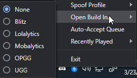
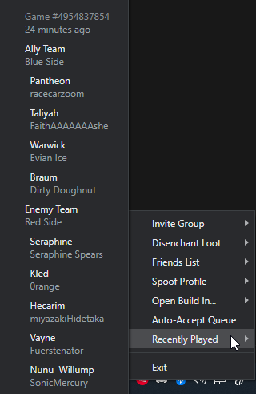
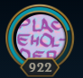
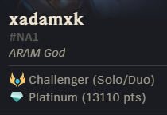

# 🎮 LCU Enhancement Suite

A compilation of features to enhance your League of Legends experience.

Running as a background application, found in your system tray, LCU Enhancement Suite features can be found by right clicking the application icon. 

## Download
[Download Link](https://github.com/xadamxk/LCU-Enhancement-Suite/releases/latest)

## Features
- Open recommended build in browser during champion select (SR & ARAM ONLY) for the following providers:
     - Blitz.gg
     - Lolalytics
     - Mobalytics
     - Op.gg
     - U.gg
     

Screenshot

- Quick invite recently played players

Screenshot

- Quick invite players by friend group
- Advanced loot disenchantment for owned & unowned resources including:
     - Champion Capsules
     - Champion Shards
     - Eternal Set Shards
     - Summoner Icons
     - Skin Shards
     - Ward Skin Shards
     - Forge Key Fragments
- Import & export friends across accounts
- Spoof profile properties including:
     - Availability (Friends List)
     - Icon (Friends List)
     - Rank (Friends List)
     

Screenshot

- Auto accept queue prompt

## Riot Games

This project isn’t endorsed by Riot Games and doesn’t reflect the views or opinions of Riot Games or anyone officially involved in producing or managing League of Legends. League of Legends and Riot Games are trademarks or registered trademarks of Riot Games, Inc. League of Legends © Riot Games, Inc.

## License

This project is licensed under the MIT License - see the [LICENSE](LICENSE) file for details
